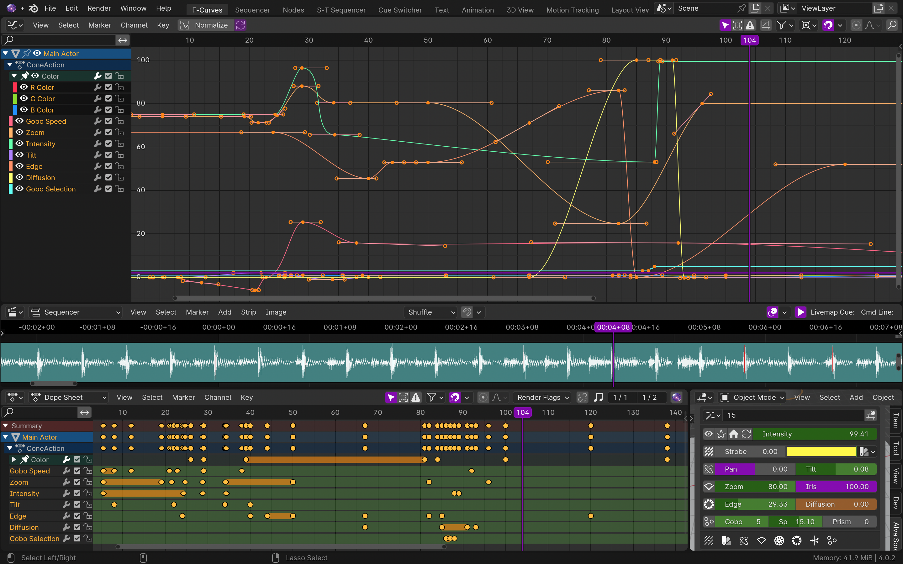

<!--
Following Blender's lead on this, keeping this short and concise. Seems like a good idea
since this way, we can put all the efforts towards one place, the main website. Previously,
there were issues where the website would be up to date, but this readme was very
different and old, or the other way around. This way there is only one primary communicator 
to maintain.
-->

Alva Sorcerer
==============
Sorcerer is a Blender add-on that lets Blender animate a performance venue's control booth. Blender is ["the free and open source 3D creation suite. It supports the entirety of the 3D pipeline-modeling, rigging, animation, simulation, rendering, compositing, motion tracking and video editing."](https://projects.blender.org/blender/blender/) Sorcerer links many of Blender's editors directly to QLab for 3D audio and to ETC Eos or grandMA3 for lighting, including:

- **3D Viewport:** Control lights and sounds with 3D objects
- **Video Sequence Editor:** Sequence events intuitively
- **Node Editor:** Use node layouts for controllers
- **Graph Editor:** Animate parameters with maximum precision
- **Text Editor:** Interact with Sorcerer with scripting

Links
-----
- [Sorcerer Website](https://sorcerer.alvatheaters.com/)
- [Manual](https://alva-sorcerer.readthedocs.io/en/latest/index.html#)
- [Support](https://sorcerer.alvatheaters.com/support)

Development/Python API
-----------------------
- [Development README](https://github.com/Alva-Theaters/Sorcerer/blob/main/maintenance/DEVELOPERS.md)

License
-------
Sorcerer is licensed under the GNU General Public License, Version 3.
