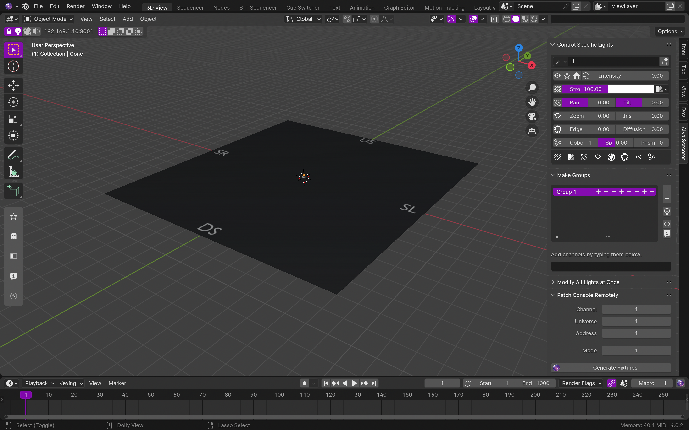
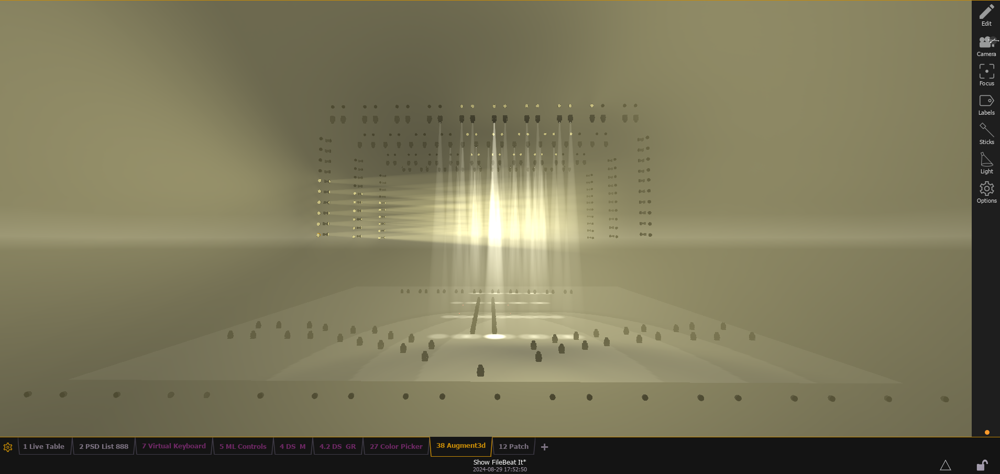
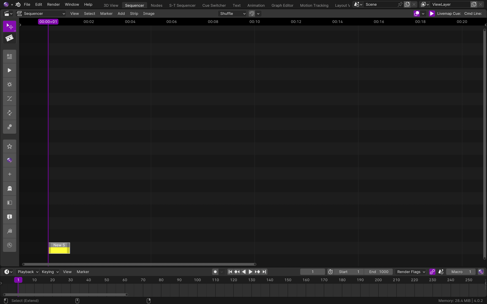
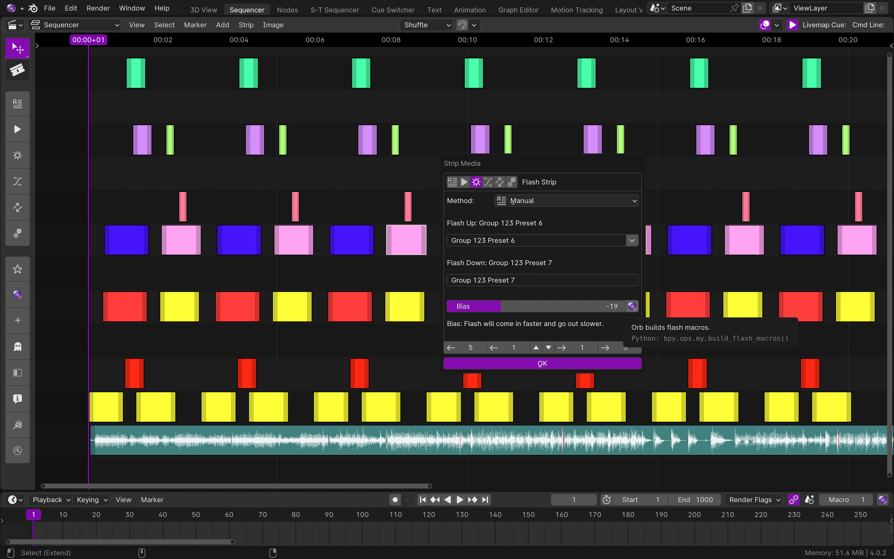
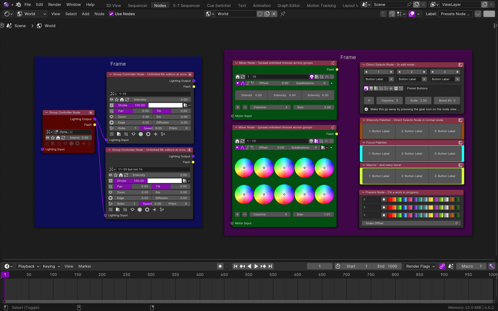
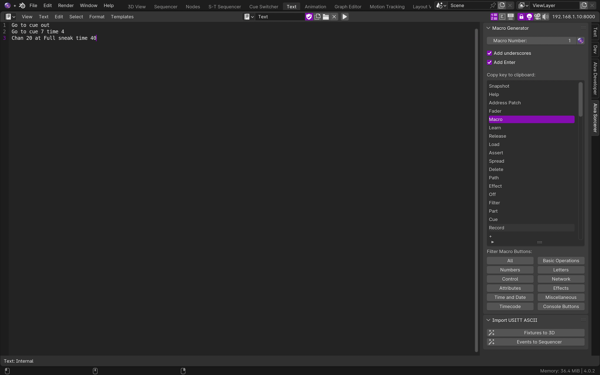
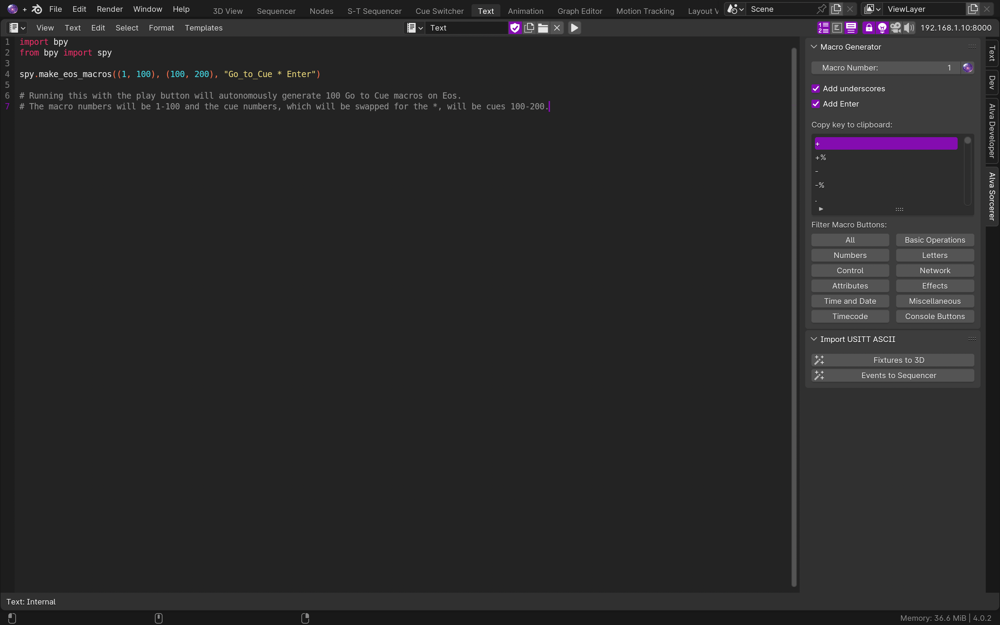
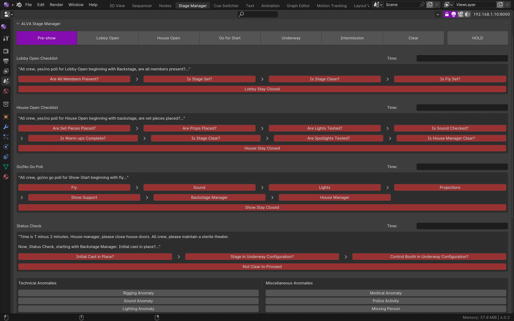
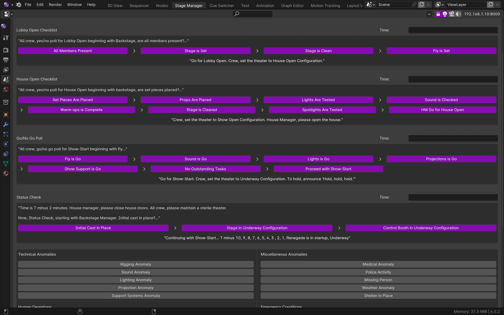
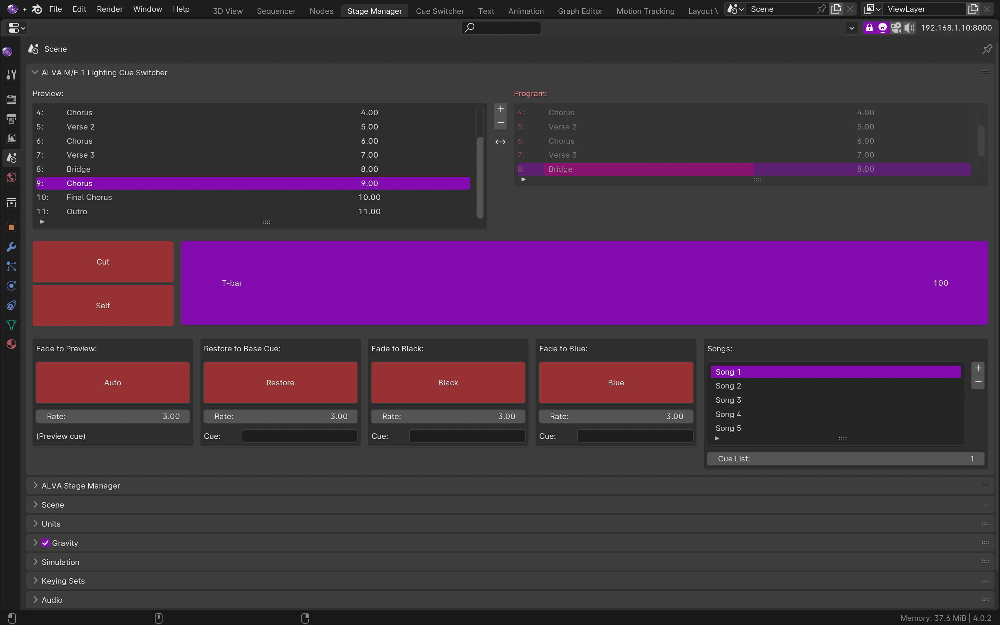

Alva Sorcerer
======================================================================
Alva Theaters' Alva Sorcerer connects ETC Eos theatrical lighting consoles to Blender's 

- 3D Viewport
- Video Sequence Editor
- Node Editor
- Graph Editor
- Dope Sheet
- Non-Linear Animation (NLA) Editor
- Text Editor

  

Sorcerer is intended for theatrical lighting designers who struggle with the procedural complexity of conventional lighting consoles. Blender provides non-procedural controls, which Sorcerer links to Eos.

Links
------
- [Sorcerer Website](https://sorcerer.alvatheaters.com/)
- [Manual](https://alva-sorcerer.readthedocs.io/en/latest/index.html#)
- [Support](https://sorcerer.alvatheaters.com/support)

The Alva Experience
-------------------
Alva Theaters designs software with only one priority: the artist experience. It's not a top priority, it's the *only* priority.

  

- Do art and be happy
- Make the lights come alive
- It's art, not programming

3D View:
--------
Sorcerer uses Blender's 3D viewport not as a visualizer, but as a controller.

  

 

  
  

 

**Other 3D Controls**

- 3D magic sheets.

- "Brushes" to "paint" lighting changes onto fixtures or stage objects. 

- Remotely patch Augment 3D using Shift+Duplicate and curve modifiers.

- Global modifiers like in photo editing

Sequencer
---------
Alva Sorcerer uses Blender's Video Sequence Editor to remotely manage event lists and timecode clocks on Eos. 

  

 

Sorcerer provides tools like Scale, Extrude, Duplicate Pattern, Copy/Paste, and others for timecode events.

  

 

Nodes
-----
Alva Sorcerer uses Blender's node editor to provide a customizable workspace.

  

 

  

 

Text Editor
-----------
Alva Sorcerer uses Blender's Text Editor to build macros and to script Eos using Python.

  

 

  

 

Extras
------
Stage-manage a theatre show like a rocket launch director with Sorcerer's experimental Stage Manager tool:

  

 

  

 
 

Or take lighting cues like a video switcher operator with Sorcerer's experimental Live Cue Switcher tool:

  

 

Compatibility:
--------------

- Alva Sequencer was initially developed in Blender 2.79, but has since been adapted to Blender 4.0
- Alva Sorcerer 1.0 and 2.0 were developed on Blender 4.0
- The most up-to-date Alpha version of Sorcerer is compatible with up to Blender 4.2.

Installation and Setup:
-----------------------

- Download and install the latest version of Blender from Blender.org
- Click "Preferences" under "Edit" at the top left, click the "Add-ons" button on the left, click the "Install" button on the top right, select Sorcerer/Sequencer, and then click the checkbox next to the new addon to enable Sorcerer/Sequencer. 
- Navigate to the Shader Editor/World, 3D view, or to the video editor  to find Sorcerer/Sequencer UI elements on side N panels, on the T toolbars on the right, by the orb icon in the headers, or on keyboard popup menus ("P" in 3D view for channel controller, "F" in node editor and video editor for Formatter, and "M" in the video editor for Strip Media)
- Note: Blender recently changed its Preferences UI. The latest version (4.2) has the Install Addon button on a drop down off a down arrow button in the upper right-hand corner inside Preferences.

Examples and Tutorials:
-----------------------

- Alva Theaters YouTube channel: https://www.youtube.com/channel/UCE6Td8fdLPvv3VLdfjIz5Dw
- Software Documentation: https://alva-sorcerer.readthedocs.io/en/latest/index.html#

Contributions Guidelines:
-------------------------

- Any help is welcome. Contact info is jordan@jordanhenshaw.com.

Support and Community:
----------------------

- If you are a customer of Alva Theaters, the software you purchased should be supported via WorkStraight, so create work order requests through the links provided to you on the marketplace if something is broken
- If you are not a customer, you can ask for help at help@alvatheaters.com
- If a decision made by the software seems really dumb, consider venting about it to thisisdumb@alvatheaters.com
- Alva Theaters has a subreddit for discussing its software: https://www.reddit.com/r/alvatheaterssoftware/

License
-------

Sorcerer is licensed under the GNU General Public License, Version 3.
